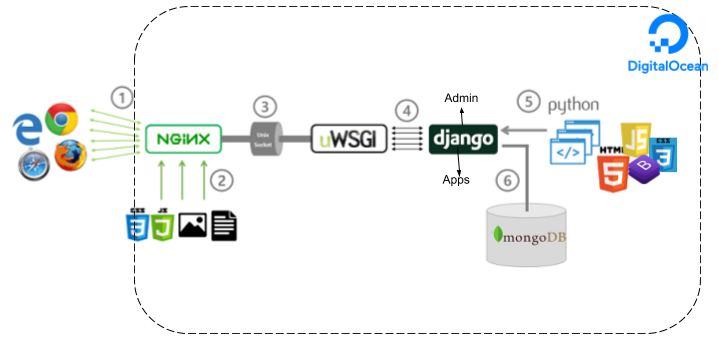

## Proyecto Chatbot y trazabilidad para el estado peruano #CoronaVirus


Somos un movimiento voluntario de activistas de la información al servicio de una sociedad abierta, nuestra base de fundamenta en la transparencia y colaboración a partir de la integración cultural.
Si te sientes identificado únete a este movimiento.

Nuestro objetivo : Impulsar un sistema de Gobernación Abierta, desde la interdisciplinaria entre hackactivista, gobierno y sociedad civil.

### Requisitos:
- git
- pip3 
- virtualenv 
- python3.6.8 
- mongodb-4.0
- django2.2

### Instalacion de dependencias del S.O(ubuntu 18.04)

Si no tiene instalado pip y virtualenv
```
sudo apt update && sudo apt install python3-pip	&& sudo pip3 install virtualenv 
```

### Ejecución en modo desarrollo:

```
git clone git@github.com:alejandrohdo/hackactivista.git
```
creación y activación de un entorno virtual
```
virtualenv -p python3 env_hackactivista && source env_hackactivista/bin/activate
```
```
cp hackactivista/config/example_config.json_copy hackactivista/config/develop.json && cd hackactivista
```
```
pip install -r requirements/develop.txt
```
Confgurar su DB, antes de ejecutar las migraciones.. 

Ejecución de migraciones
```
./manage.py makemigrations && ./manage.py migrate
```
Creacion de super usuario
```
./manage.py createsuperuser
```
Ejecuación en modo desarrollo
```
 ./manage.py runserver
```

### Configuración de mongodb
en terminal ejecutar
```
 use admin
```
```
 db.createUser( { user: "user_xxx", pwd: "passs_xxx", roles: [ { role: "userAdminAnyDatabase", db: "admin" }, "readWriteAnyDatabase" ] } )
```
habilitando autenticación
```
sudo nano /etc/mongod.conf
```

en bindIp: IP_PC_Interna o localhost 
```
security:
  authorization: "enabled" # Para autenticar o no "enabled" o "disabled"
```
```
sudo service mongod restart 
```

por último en config/develop.json, actualizar conexión a DB